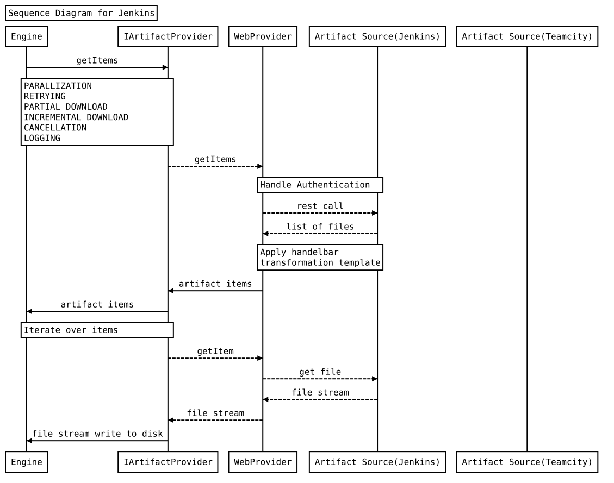

# Artifact Engine

## Overview
Artifact engine is a generic framework which supports download of artifacts from different providers like *jenkins, teamcity, vsts, github-releases* etc.
The framework is extensible and other providers can be easily plugged in the downloader.

## How to Use
To use Artifact engine in your tasks or app, see the provider and engine test coverage under `EngineTests` and `ProvidersTests` for end-to-end usage examples.

## Architecture

## Development
**Build**
---------
1. Run npm install in ArtifactEngineV2 folder
2. Use command ctrl-shift-b to build from vscode

**Testing**
----------
*vscode*
----------
1. Install [mocha sidebar](https://marketplace.visualstudio.com/items?itemName=maty.vscode-mocha-sidebar) extension to run tests from vscode.
2. Optional install [node tdd](https://marketplace.visualstudio.com/items?itemName=prashaantt.node-tdd) extension to automatically run tests on build.

*node*
------
1. Build artifact-engine from repository root:

    `node make.js --build --packageName artifact-engine`
2. Run artifact-engine default test suite from repository root:

    `node make.js --test --packageName artifact-engine`
