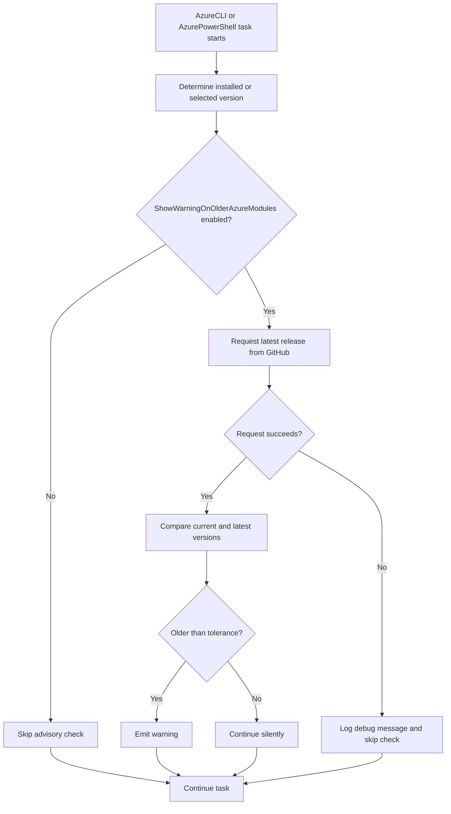

# Azure module version-check flow

This document explains how AzureCLI and AzurePowerShell determine the installed tool version, request the latest release, and decide whether to show an outdated-version warning. It also explains where the `azure-pipelines-tasks-azure-arm-rest` package participates and how Windows and Linux AzurePowerShell execution differ.

## Repositories involved

The flow crosses two repositories:

- `microsoft/azure-pipelines-tasks` contains the AzureCLI and AzurePowerShell task implementations.
- `microsoft/azure-pipelines-tasks-common-packages` contains the shared `azure-pipelines-tasks-azure-arm-rest` package.

The relevant shared-package files in this repository are:

- `common-npm-packages/azure-arm-rest/azCliUtility.ts`
- `common-npm-packages/azure-arm-rest/webClient.ts`
- `common-npm-packages/azure-arm-rest/Tests/L0-web-client-tests.ts`

## High-level flow



The version check is advisory. A GitHub failure must not prevent authentication or execution of the customer's script.

## AzureCLI V2 and V3

AzureCLI V2 and V3 follow the same general path.

### 1. Read the installed Azure CLI version

The task executes one of these commands:

```typescript
azVersionResult = tl.execSync("az", "version");
```

or:

```typescript
azVersionResult = tl.execSync("az", "--version");
```

`az version` returns structured output on supported versions. The task falls back to `az --version` when needed.

### 2. Call the shared package

The task imports:

```typescript
import { validateAzModuleVersion }
    from "azure-pipelines-tasks-azure-arm-rest/azCliUtility";
```

It then calls:

```typescript
const minorVersionTolerance = 5;

await validateAzModuleVersion(
    "azure-Cli",
    azVersionResult.stdout,
    "Azure-Cli",
    minorVersionTolerance
);
```

The arguments mean:

| Argument | Meaning |
| --- | --- |
| `azure-Cli` | GitHub repository name under the `Azure` organization |
| `azVersionResult.stdout` | Installed Azure CLI version output |
| `Azure-Cli` | Display name used in a warning |
| `5` | Allowed minor-version difference before warning |

### 3. Continue the real task

After the advisory check, AzureCLI configures its profile, authenticates to Azure, and runs the customer's script. A failed advisory check does not stop these operations.

## Shared `azCliUtility` flow

The shared entry point is `validateAzModuleVersion()` in `azCliUtility.ts`.

### 1. Check the feature flag

```typescript
const displayWarningForOlderAzVersion =
    tl.getPipelineFeature("ShowWarningOnOlderAzureModules");
```

When the feature is disabled, no GitHub request is made.

The request behavior is controlled separately by:

```typescript
tl.getPipelineFeature("EnableAzureModuleVersionCheckRequestTimeout");
```

This second feature flag supports gradual rollout and rollback without disabling the advisory check itself.

| Warning feature | Request-timeout feature | Behavior |
| --- | --- | --- |
| Off | Either value | Skip the GitHub request |
| On | Off | Use the original request behavior |
| On | On | Use one attempt, a three-second deadline, and suppressed task errors |

### 2. Get the latest GitHub release

The package creates this URL:

```typescript
request.uri =
    `https://api.github.com/repos/Azure/${moduleName}/releases`;
request.method = "GET";
```

For AzureCLI, the URL is:

```text
https://api.github.com/repos/Azure/azure-Cli/releases
```

For AzurePowerShell, the URL is:

```text
https://api.github.com/repos/Azure/azure-powershell/releases
```

### 3. Apply request-scoped protection

When `EnableAzureModuleVersionCheckRequestTimeout` is enabled, the Node/common-package path calls:

```typescript
const response = await webClient.sendRequest(
    request,
    Object.assign(new webClient.WebRequestOptions(), {
        retryCount: 1,
        requestTimeout: 3000,
        suppressErrorIssue: true
    })
);
```

The options mean:

- `retryCount: 1`: make one request attempt.
- `requestTimeout: 3000`: impose an approximately three-second overall deadline.
- `suppressErrorIssue: true`: do not emit a red Azure Pipelines task error for this advisory failure.

These options are passed only by this GitHub advisory request. Ordinary ARM requests do not inherit the three-second deadline.

When the feature is disabled, the package preserves the previous call:

```typescript
await webClient.sendRequest(request);
```

### 4. Select the release

AzureCLI uses the first release returned by GitHub:

```typescript
response?.body?.[0]
```

AzurePowerShell filters for major releases whose tags end in `.0`, such as `v15.0.0`:

```typescript
response?.body
    ?.filter(release => release?.tag_name?.match(/^v\d+\.\d+\.0/))
    ?.[0]
```

### 5. Compare versions

`validateAzModuleVersion()` extracts major and minor numbers from the current and latest versions.

For AzureCLI, it checks major and minor differences. For AzurePowerShell, callers pass `checkOnlyMajorVersion: true`, so only the major-version difference controls the warning.

### 6. Fail open

The GitHub request is wrapped in `try/catch`:

```typescript
catch (err) {
    tl.debug(
        `Error checking Azure version: ${err.message}. ` +
        `Hence skipping the check for latest version of ${moduleName}.`
    );
}
```

A timeout, refused connection, DNS error, or GitHub error therefore produces a debug message and returns control to the task.

## Shared `webClient` flow

`webClient.ts` adds two optional request settings:

```typescript
public requestTimeout?: number;
public suppressErrorIssue?: boolean;
```

They are optional so existing callers remain compatible.

### Overall timeout

For a timeout-enabled request, the client starts both the HTTP request and a timer:

```typescript
return await Promise.race([
    responsePromise,
    timeoutPromise
]);
```

If the request wins, its response is returned. If the timer wins, the package creates an `ETIMEDOUT` error and closes the pending network resources.

### Proxy cancellation

A socket timeout alone does not cover every stage of HTTPS proxy setup. A proxy can accept the TCP connection and then never complete the `CONNECT` operation.

`prepareRequestResources()` tracks pending proxy requests and active sockets. On timeout, it destroys them so the request does not continue in the background.

### Error annotation behavior

The shared client normally emits a task error for coded request failures. The new condition is:

```typescript
if (error.code && !(options && options.suppressErrorIssue)) {
    const message = error.message || error.code;
    console.log(
        `##vso[task.logissue type=error;code=${error.code};]${message}`
    );
}
```

Only the advisory call sets `suppressErrorIssue: true`. Other callers retain the previous task-error behavior.

### Cleanup

A `finally` block always:

- clears the timeout timer;
- destroys timeout-specific request resources;
- disposes the `typed-rest-client` client.

## AzurePowerShell V5: handler selection

AzurePowerShell V5 declares multiple execution handlers in its `task.json`:

```json
{
  "PowerShell3": {
    "target": "azurepowershell.ps1",
    "platforms": ["windows"]
  },
  "Node16": {
    "target": "azurepowershell.js"
  },
  "Node20_1": {
    "target": "azurepowershell.js"
  }
}
```

This creates two distinct version-check implementations:

| Agent/handler | Task implementation | Latest-release HTTP implementation |
| --- | --- | --- |
| Windows with `PowerShell3` | `AzurePowerShell.ps1` and `Utility.ps1` | PowerShell `Invoke-RestMethod` |
| Linux Node handler | `azurepowershell.ts` and shared `azCliUtility.ts` | `azure-arm-rest/webClient.ts` |
| Windows Node handler, when selected | Same Node/common-package path | `azure-arm-rest/webClient.ts` |

When `EnableAzureModuleVersionCheckRequestTimeout` is enabled, the three-second `requestTimeout` protects the Node/common-package path. It does not rewrite the separate `Invoke-RestMethod` call in the native Windows `PowerShell3` handler.

## AzurePowerShell inputs

The YAML aliases map to task inputs as follows:

| YAML input | Internal input | Meaning |
| --- | --- | --- |
| `azurePowerShellVersion` | `TargetAzurePs` | `LatestVersion` or `OtherVersion` |
| `preferredAzurePowerShellVersion` | `CustomTargetAzurePs` | Exact version used with `OtherVersion` |
| `pwsh` | `pwsh` | On Windows, choose PowerShell Core for script execution |

The selected version affects two related but different operations:

1. Which Az module is loaded for the task.
2. Which current version is compared with the latest GitHub release.

## AzurePowerShell on Linux: Node/common-package path

Linux uses the Node task handler.

### `OtherVersion`

When the user selects an explicit version:

```typescript
if (targetAzurePs === "OtherVersion") {
    targetAzurePs = customTargetAzurePs;
    await validateAzModuleVersion(
        "azure-powershell",
        customTargetAzurePs,
        "Az module",
        3,
        true
    );
}
```

The task already knows the current version because the user supplied it.

### `LatestVersion`

For latest installed version, the task clears the target version:

```typescript
targetAzurePs = "";
```

When the feature flag is enabled, it calls `getInstalledAzModuleVersion()`.

That function starts `pwsh` and executes:

```powershell
. './Utility.ps1'
Get-InstalledMajorRelease -moduleName 'Az' -isWin $false
```

`Get-InstalledMajorRelease` searches in this order:

1. Hosted-agent folders under `/usr/share/az_<version>`.
2. `Get-InstalledModule -Name Az`.
3. `Get-Module -Name Az -ListAvailable`.
4. Common module paths for a self-hosted agent.

The highest valid version is returned to TypeScript and then passed to the shared `validateAzModuleVersion()` function.

### Load the selected module

The generated script runs:

```powershell
TryMakingModuleAvailable.ps1 -targetVersion '<version>' -platform Linux
```

Then `InitializeAz.ps1` calls:

```powershell
Update-PSModulePathForHostedAgentLinux -targetAzurePs $targetAzurePs
```

Linux hosted-agent modules are stored under:

```text
/usr/share/az_<version>
```

The path is prepended to `PSModulePath` with `:` as the separator. If no explicit version was selected, the task chooses the highest valid hosted-agent folder and then imports the highest available `Az.Accounts` module.

## AzurePowerShell on Windows: native PowerShell path

The Windows `PowerShell3` handler executes `AzurePowerShell.ps1`.

### Normalize the requested version

The script reads:

```powershell
$targetAzurePs = Get-VstsInput -Name TargetAzurePs
$customTargetAzurePs = Get-VstsInput -Name CustomTargetAzurePs
```

For `OtherVersion`, it replaces `$targetAzurePs` with the explicit custom version. For `LatestVersion`, it converts the value to an empty string:

```powershell
if ($targetAzurePs -eq $latestVersion) {
    $targetAzurePs = ""
}
```

An empty target means "choose the latest installed version."

### Make the module available

The Windows handler runs:

```powershell
. $PSScriptRoot\TryMakingModuleAvailable.ps1 `
    -targetVersion "$targetAzurePs" `
    -platform Windows
```

Hosted-agent Az modules are stored under:

```text
C:\Modules\az_<version>
```

`Update-PSModulePathForHostedAgent` prepends the selected folder to `PSModulePath` using `;` as the Windows separator. With an empty target, it selects the highest valid `C:\Modules\az_<version>` folder.

### Determine the version used for the warning

The Windows handler calls:

```powershell
Initialize-ModuleVersionValidation `
    -moduleName "azure-powershell" `
    -targetAzurePs $targetAzurePs `
    -displayModuleName "Az" `
    -versionsToReduce 3
```

If `$targetAzurePs` is empty, `Initialize-ModuleVersionValidation` discovers the installed version using:

```powershell
Get-InstalledMajorRelease -moduleName "Az" -isWin $true
```

The discovery order is the same logical order as Linux, but the hosted-agent folder search uses `C:\Modules` instead of `/usr/share`.

### Request the latest version

The native Windows handler does not call `azCliUtility.ts`. Its `Utility.ps1` calls GitHub directly:

```powershell
Invoke-RestMethod -Uri $url -Method Get
```

Errors are caught and written as verbose output, so this path is fail-open. However, it is a separate HTTP implementation and does not receive the Node `requestTimeout: 3000` option from this PR.

## Windows and Linux comparison

| Concern | Windows `PowerShell3` | Linux Node handler |
| --- | --- | --- |
| Entry point | `AzurePowerShell.ps1` | `azurepowershell.ts` |
| Hosted module root | `C:\Modules` | `/usr/share` |
| Hosted folder format | `az_<version>` | `az_<version>` |
| `PSModulePath` separator | `;` | `:` |
| Installed-version helper | `Get-InstalledMajorRelease -isWin $true` | `Get-InstalledMajorRelease -isWin $false` launched from Node |
| Latest-release request | `Invoke-RestMethod` in `Utility.ps1` | `azCliUtility.ts` -> `webClient.ts` |
| Three-second PR timeout | No | Yes, when the rollout feature is enabled |
| Failure behavior | Catch and verbose skip | Catch and debug skip |

## Scope of this PR

When `EnableAzureModuleVersionCheckRequestTimeout` is enabled, the Node/common-package path used by AzureCLI and Node-based AzurePowerShell execution provides:

- one GitHub attempt;
- approximately three seconds maximum for the advisory request;
- cancellation of stalled direct and proxy connections;
- no task error annotation for advisory failures;
- debug visibility and fail-open continuation;
- no timeout change for ordinary ARM requests.

The native Windows `PowerShell3` advisory request remains a separate implementation. If identical three-second behavior is required there, `AzurePowerShellV5/Utility.ps1` in the tasks repository needs its own bounded `Invoke-RestMethod` implementation and Windows-specific tests.

## Validation performed

The shared-package tests cover:

- timeout forwarding;
- one-attempt behavior;
- error-annotation suppression;
- client cleanup after success and failure;
- direct stalled requests;
- stalled HTTPS proxy `CONNECT` requests;
- feature-disabled behavior;
- debug-only fail-open behavior;
- an ordinary request taking more than four seconds without inheriting the advisory timeout.

The full `azure-arm-rest` L0 suite passed with 28 tests after synchronizing the branch with `main`.
